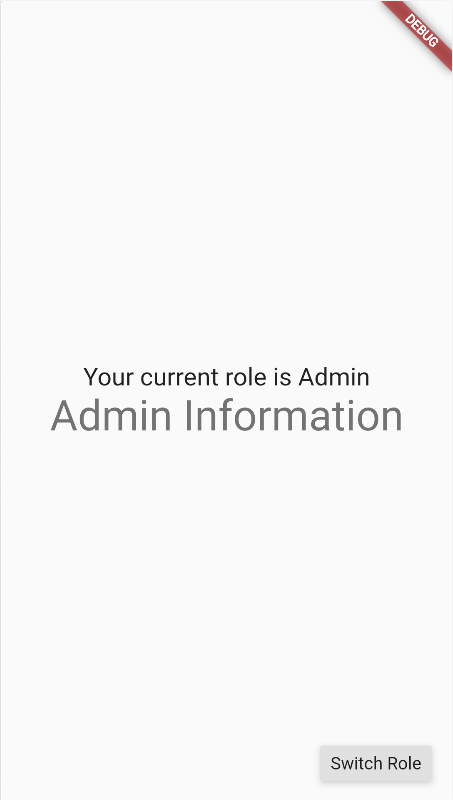
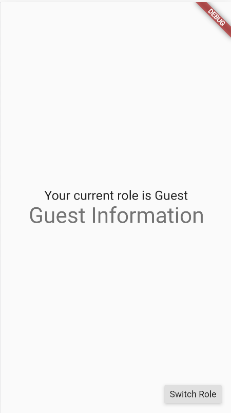

# widget_permission_manager
A Widget to control the child widget based on the accessing role using the app.


## Getting Started

#### Use this package as a library
1. Depend on it
Add this to your package's pubspec.yaml file:
```
dependencies:
  widget_permission_manager: ^0.1.1
```

2. Install it
You can install packages from the command line:

```
$ pub get
or
$ flutter pub get
```

3. Import it
Now in your Dart code, you can use:
```
import 'package:authentication_widget/authentication_widget.dart';
```

## Example



```
library authentication_widget;

import 'package:authentication_widget/authorization.dart';
import 'package:authentication_widget/authorization_widget.dart';
import 'package:flutter/material.dart';

void main() {
  runApp(MyApp());
}

class MyApp extends StatelessWidget {
  // This widget is the root of the application.
  @override
  Widget build(BuildContext context) {
    return MaterialApp(
      // title of the app
      title: 'Authorization Widget Demo',
      // home page of the app
      home: MyHomePage(),
    );
  }
}

class MyHomePage extends StatefulWidget {
  // constructor
  MyHomePage();

  @override
  _MyHomePageState createState() => _MyHomePageState();
}

class _MyHomePageState extends State<MyHomePage> {
  // set default role for the user
  String _role = 'Admin';
  // create an Authorization object
  Authorization _authorization = Authorization(0, 'Admin only', ['Admin']);

  @override
  Widget build(BuildContext context) {
    return Scaffold(
      body: Center(
        child: Column(
          mainAxisAlignment: MainAxisAlignment.center,
          children: <Widget>[
            Text(
              // shows current role of the user
              'Your current role is $_role',
              style: Theme.of(context).textTheme.headline6,
            ),
            // uses Authorization Widget to evaluate shown information
            // set Duration if you want slower or faster switch, if role changed
            AuthorizationWidget(
              // give role
              // you usually get this from a user- or role-service
              role: _role,
              // give authorization to validate
              auth: _authorization,
              // set child shown if validation is approved
              child: Text(
                'Admin Information',
                style: Theme.of(context).textTheme.headline4,
                textAlign: TextAlign.center,
              ),
              // set alternativeChild shown if validation fails
              // if no alternateChild is set it is been replaced with a SizedBox()
              alternateChild: Text(
                'Guest Information',
                style: Theme.of(context).textTheme.headline4,
                textAlign: TextAlign.center,
              ),
            ),
          ],
        ),
      ),
      // Button to switch roles
      floatingActionButton: RaisedButton(
        // onPressed event
        onPressed: _switchRole,
        // tesxt of the button
        child: Text('Switch Role'),
      ), // This trailing comma makes auto-formatting nicer for build methods.
    );
  }

  void _switchRole() {
    setState(() {
      // change between roles Admin and Guest
      _role = _role == 'Admin' ? 'Guest' : 'Admin';
    });
  }
}
```

## Copyright

```
Copyright 2020 lucianojung.de

Redistribution and use in source and binary forms, with or without modification, are permitted provided that the following conditions are met:

1. Redistributions of source code must retain the above copyright notice, this list of conditions and the following disclaimer.

2. Redistributions in binary form must reproduce the above copyright notice, this list of conditions and the following disclaimer in the documentation and/or other materials provided with the distribution.

3. Neither the name of the copyright holder nor the names of its contributors may be used to endorse or promote products derived from this software without specific prior written permission.

THIS SOFTWARE IS PROVIDED BY THE COPYRIGHT HOLDERS AND CONTRIBUTORS "AS IS" AND ANY EXPRESS OR IMPLIED WARRANTIES, INCLUDING, BUT NOT LIMITED TO, THE IMPLIED WARRANTIES OF MERCHANTABILITY AND FITNESS FOR A PARTICULAR PURPOSE ARE DISCLAIMED. IN NO EVENT SHALL THE COPYRIGHT HOLDER OR CONTRIBUTORS BE LIABLE FOR ANY DIRECT, INDIRECT, INCIDENTAL, SPECIAL, EXEMPLARY, OR CONSEQUENTIAL DAMAGES (INCLUDING, BUT NOT LIMITED TO, PROCUREMENT OF SUBSTITUTE GOODS OR SERVICES; LOSS OF USE, DATA, OR PROFITS; OR BUSINESS INTERRUPTION) HOWEVER CAUSED AND ON ANY THEORY OF LIABILITY, WHETHER IN CONTRACT, STRICT LIABILITY, OR TORT (INCLUDING NEGLIGENCE OR OTHERWISE) ARISING IN ANY WAY OUT OF THE USE OF THIS SOFTWARE, EVEN IF ADVISED OF THE POSSIBILITY OF SUCH DAMAGE.
```